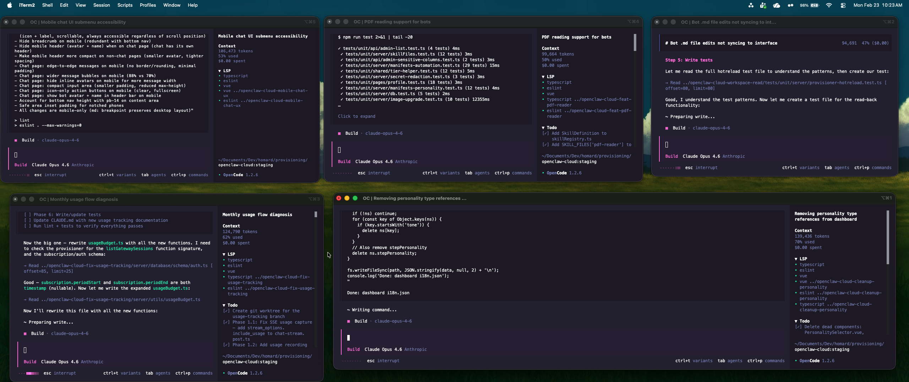

<p align="center">
  
</p>

<p align="center">
  <em>An opinionated workspace for parallel AI coding agents</em>
</p>

---

`swarm` gives you a TUI control panel for running multiple AI coding agents side by side, each in its own git worktree, orchestrated through tmux. You stay in one terminal. The agents do the work.

It works with **Claude Code**, **OpenCode**, **Codex**, or a plain shell. Pick an agent, swarm creates a worktree on a fresh branch, opens a pane, and launches it. When you're done, apply the changes, keep the branch, or drop everything.

## Install

```sh
go install github.com/dev-t0ny/swarm@latest
```

Make sure `~/go/bin` is in your `PATH`.

## Usage

```sh
cd your-repo
swarm
```

That's it. Swarm detects your project type, bootstraps a tmux session, and drops you into the dashboard.

## Features

- **Parallel agents** -- spawn Claude Code, OpenCode, Codex, or shell sessions side by side
- **Isolated worktrees** -- each agent gets its own git worktree on a `swarm/agent-N` branch
- **Auto-tiled grid** -- tmux panes reflow automatically as agents are added or removed
- **Dev servers** -- attach a dev server to any agent with automatic port allocation
- **Agent resolution** -- apply (merge), keep (preserve branch), or drop (delete everything)
- **Project presets** -- auto-detects Next.js, Vite, Node, Go, Rust, Python, Ruby and sets sensible defaults
- **Symlink engine** -- `.env` and config files are symlinked into each worktree
- **Event-driven** -- pane health monitoring via tmux hooks, not polling
- **One quit kills everything** -- agents, panes, session, back to your normal terminal

## Configuration

Create a `.swarmrc` in your repo root to override defaults:

```yaml
dev_command: "npm run dev -- --port {port}"
install_command: "npm install"
base_port: 3000
symlinks:
  - .env
  - .env.local
```

Project presets fill in these values automatically. Your `.swarmrc` always wins.

## Requirements

- [tmux](https://github.com/tmux/tmux) >= 3.2
- [git](https://git-scm.com)
- [Go](https://go.dev) >= 1.23

## License

MIT
